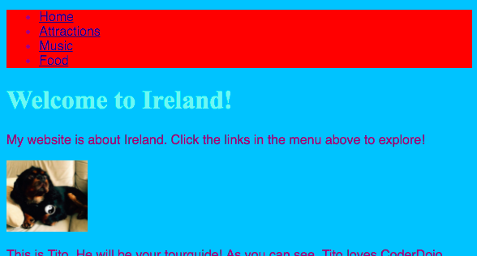

## Making a menu

- Many websites have a **navigation** menu to make it easy to get around the pages. Now that you've got a bunch of pages, a homepage, and links to get around, let's move the links to a navigation section at the top. 

- Just before the opening `<ul>` tag, press enter to create a new blank line, then on the new line type the following tag: `<nav>`. Trinket automatically adds in the closing tag for you, you can delete that for now.

- Just _after_ the _closing_ `</ul>` tag, press enter to go onto a new line, and type in the closing tag `</nav>`. 
   "nav" stands for **navigation**. The `nav` section is a set of tools for getting around a website.

- Now, select your entire `nav` section and list by clicking just before the opening `<nav>` tag and dragging the mouse all the way until just after the closing `</nav>` tag, so that all of the text including the opening and closing tags becomes highlighted. Make sure all of the **angle brackets** `<` and `>` at the start and end are highlighted too! 

- You are going to **cut** this time instead of **copy**. Press and hold the **Ctrl** \(or **cmd**\) key and while holding it press the **X** key. The code will disappear but don't panic!

- At the top of the file, click in the space between the `<header> </header>` tags. Make sure you see the cursor flashing there. Now **paste** in the code by pressing **Ctrl** \(or **cmd**\) and **V** together as usual. Click Run to see your changes! The code should look something like this:
   ```html
   <header>
      <nav>
         <ul>
            <li><a href="index.html">Home</a></li>
            <li><a href="attractions.html">Attractions</a></li>
            <li><a href="music.html">Music</a></li>
            <li><a href="food.html">Food</a></li>
         </ul>
      </nav>
   </header>
   ```

   If you make a mistake, you can **undo** it by pressing **Ctrl** \(or **cmd**\) and **Z** together. You can usually press it a few times to undo the last couple of changes. This is another handy shortcut that you can use in many programs!

- To make the navigation menu appear at the top of every page on your website, you put the same code into each new file that you created. Select the entire `nav` section like you did before, and press the **Ctrl** \(or **cmd**\) and **C** keys together to **copy** it. Then, in each of your other files, click inside the `<header> </header>` section and **paste** the code exactly like you did in Step 6.

- Now when you click Run, you will be able to click the links no matter which page you are on. Remember to  click Save when you're done!

- By adding more **CSS** rules in the stylesheet, you can transform your navigation menu into a cool looking menu bar! 

- Go to the stylesheet file. Remember it is in the styles.css tab. Click _after_ a closing curly brace `}` and press enter to go onto a new line. Add the following rule.
   ```css
      nav ul {
         background-color: tomato;
      }
   ```

- Notice how you used **two selectors** instead of one? If you used the `ul` selector on its own, the rule would affect _all_ unordered lists on your website. Adding the `nav` selector as well makes it only apply to lists that are in between `nav` tags.

- Click Run to see what it looks like. 

- Let's get rid of the bullet points. These are the spots in front of each list item. Go to the styles.css tab and add the following to the file. Again, type it on a new line after a `}` so it's not accidentally inside any other block of rules.
   ```css
   nav ul li {
      list-style-type: none;
   }
   ```
Notice this set of rules has _three_ selectors! It selects all `li` elements that are in a `ul` list which is inside a `nav` section. Phew! 

- Now let's make the list horizontal (across) instead of vertical (down). Inside the new set of rules, add the following line: `display: inline;`  
 The menu items are all squashed together, so let's also add the properties `margin-right` and `margin-left` to space them out a bit. The rules should look like this now:
   ```css
   nav ul li {
      list-style-type: none;
      display: inline;
      margin-right: 10px;
      margin-left: 10px;
   }
   ```
   Remember `10px` means 10 **pixels**.

- How about making the menu change to to tell you which page you are on? This part won't be in the stylesheet.

- Let's start with the homepage. Go to the index.html file. In the list, remove the link tags before and after the word "Home", so that the list item for the homepage is just text in between `<li> </li>` tags, like this: `<li>Home</li>`.

- Now go to each of your other files, and do the same thing, each time removing the link tags for the page you are editing. So on the music.html file, remove the link tags in the "Music" list item, and so on.

- Click Run and explore your pages. See how the menu bar shows the page you're on as plain text instead of a link? 
